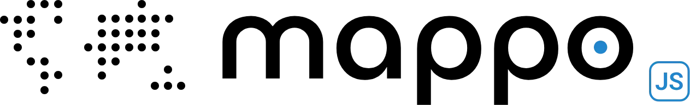

<p align="center">
  
</p>

# mappo

**A dotted world map as a zero-dependency web component.** Land dots derived
from a packed bitmask at any resolution, a built-in city registry (just type
`"London"`), shapes, tilt, pulse markers, hover/click events. One ESM file,
no build step, no dependencies.

```html
<script type="module" src="https://unpkg.com/mappo"></script>

<world-map cities="London, Lagos, Singapore" tilt="40"></world-map>
```

That's the whole integration.

## Why this exists

Every SaaS hero section eventually wants the dotted world with glowing city
markers. The usual path is a designer's frozen SVG: thousands of hardcoded
rectangles, cities placed by eye, one resolution forever. `mappo`
derives the dots from a ~22 KB packed land bitmask instead — so resolution,
dot shape, projection framing, and city markers are all runtime parameters,
and "add Nairobi" is typing `Nairobi`.

## Install

```bash
npm install mappo
```

Or skip npm entirely — it's one file:

```html
<script type="module" src="https://unpkg.com/mappo"></script>
```

Rails with importmaps:

```ruby
# config/importmap.rb
pin "mappo", to: "mappo.js" # vendor dist/mappo.js
```

## The element

```html
<world-map
  cities="London, Lagos, Singapore, New York"
  cols="140"
  dot-shape="circle"
  dot-color="#d3dce6"
  marker-color="#2262fe"
  marker-pulse="true"   <!-- animations are opt-in; default is a calm, static map -->
  tilt="40"
  animation="wave"
></world-map>
```

Attributes are live — change one, the map re-renders. Interaction bubbles as
DOM events:

```js
map.addEventListener("worldmap:cityclick", (e) => {
  console.log(e.detail.name, e.detail.lat, e.detail.lon);
});
// also: worldmap:cityenter, :dotclick, :dotenter
```

## Globe mode

The same world, wrapped on a sphere and spinning:

```html
<world-map mode="globe" cols="170" tilt="18" rotate-speed="4"
           dot-shape="square" cities="Madrid, Nairobi, Tokyo"></world-map>
```

Globe mode renders on canvas (a rotating globe re-projects every dot every
frame — that's not SVG work), so the flat renderer's guarantees change
shape: dots shrink and fade toward the limb, the back hemisphere is culled,
a hairline halo rings the sphere, and `tilt` becomes the *axial* tilt.
`rotate-speed` is degrees per second; `0` parks it. The loop pauses when
the globe scrolls offscreen, and `prefers-reduced-motion` gets a single
static frame instead of a spin.

The six animation modes work on the globe too — dots lift radially off
the surface (sparkle scales instead), driven by the same phase fields as
the flat renderer. Hover and click events fire with the same payloads as
flat mode (canvas hit-testing through the inverse projection), and the
globe is grabbable: drag to spin it, flick for momentum, and the spin
relaxes back to `rotate-speed` on its own. Flat-only for now: marker
pulse. Custom SVG path dot shapes fall back to squares on canvas.

## Backdrop

Three knobs fill the empty space, in either mode:

```html
<world-map mode="globe" ocean-color="#e8eef5" background="#f8fafc"
           globe-ring="true"></world-map>
```

- `dot-hover-color` defaults to **auto**: a contrast-aware shade of
  `dot-color` — darker for light dots, lighter for dark ones — so hovers
  never fall back to somebody else's gray. Set it (or `dot-hover-scale`)
  to override.
- `ocean-color` — water cells render as smaller filler dots in their own
  shade (think off-white on light pages, off-dark on dark ones). In flat
  mode this is a single SVG pattern — one node, any resolution, and it
  patches as pure style. Default `none`.
- `background` — a uniform fill behind everything: full-bleed rect in flat
  mode, the planet disc in globe mode. Default `none`.
- `globe-ring="true"` — adds a hairline halo around the globe (off by default).

## The JS API

```js
import { WorldMap } from "mappo";

const map = new WorldMap(document.querySelector("#hero-map"), {
  cols: 140,                       // dots across the world — the resolution
  latRange: [-58, 84],             // default framing cuts Antarctica
  dotShape: "circle",              // "circle" | "square" | "triangle" | SVG path (24×24)
  dotSize: 0.55,                   // fraction of a grid cell
  dotColor: "#d3dce6",
  dotHoverColor: "#94a8bd",
  dotHoverScale: 2.2,
  cities: [
    "Tokyo", "Berlin",             // the built-in registry (~160 cities)
    { name: "HQ", lat: 41.4, lon: 2.2, color: "#ff9900" } // or your own coords
  ],
  markerShape: "circle",
  markerColor: "#2262fe",
  markerPulse: false,
  tilt: 40,                        // the lying-down hero look (rotateX, deg)
  perspective: 1000,
  animation: "none",                 // "wave" animates the whole matrix
  cursor: "default",
  markerCursor: "pointer",
  onCityClick: ({ name }) => console.log(name)
});

map.update({ markerColor: "#ff3b30" }); // re-render with new options
map.destroy();
```

Lower-level pieces are exported too — `isLand(lat, lon)`, `project`,
`cellCenter`, `snapToLand`, and the `CITIES` registry — if you want to build
your own renderer on the same data.

## Styling

The component renders into light DOM with plain classes (`.wm-dot`,
`.wm-marker`, `.wm-svg`, `.wm-tilt`) — your stylesheet wins. The built-in
styles are defaults, not law. `prefers-reduced-motion` disables all
animation automatically.

## Design notes

### Two renderers, on purpose

The flat map is SVG. The globe is canvas. This is not an accident of
history or a migration in progress — each renderer matches the physics of
its mode, and neither should become the other.

**Why the flat map stays SVG:**

1. **SVG-ness is a feature, not an implementation detail.** Dots are real
   DOM elements: you restyle `.wm-dot` from your own stylesheet, markers
   are focusable, hover states are plain CSS, everything shows up in
   devtools, and the output is vector-crisp at any zoom and in print.
   Every canvas map library forfeits all of that. It's the reason this one
   is different.
2. **The performance math favors SVG in flat's actual regime.** A static
   SVG map costs *zero* per frame after render — and flat maps are static
   almost all the time; they re-render only when options change, which the
   differential update tiers make nearly free (style patches never touch
   geometry). Animations run as CSS keyframes: compositor-eligible,
   browser-scheduled, `prefers-reduced-motion` handled for free. A canvas
   flat map would burn main-thread JavaScript every animated frame,
   forever, to reproduce what the browser already does better.
3. **SVG only loses above ~7k animated nodes** — which is exactly the
   regime the density load gate and the cols cap already govern. The
   escape hatch for extreme grids (cols ≫ 260) is a future opt-in
   `renderer: "canvas"` behind the same options, built when someone
   actually needs 500 cols — not a wholesale conversion.

**Why the globe is canvas:**

A rotating globe re-projects every dot every frame. That's thousands of
per-frame position writes — as DOM attributes, it's the exact failure mode
the flat renderer's architecture exists to avoid; as canvas fills, it's
nothing. The globe gives up SVG's styling hooks (and re-earns the
interactive ones through inverse-projection hit-testing, so events work
the same in both modes) in exchange for a renderer that can spin at max
resolution without dropping frames.

Same options, same events, same land data — `mode` just picks the
renderer whose physics fit.

### The rest

- **Equirectangular on purpose**: this is a *symbolic* map. Linear lat/lon
  matches both the packed mask and everyone's mental world map.
- **Coastal snapping**: city coordinates snap to the nearest land dot
  (harbors sit in sea cells at coarse resolutions; a marker floating off
  the coast looks broken).
- **Globe mode is a renderer swap, not an API fork**: coordinates are
  lat/lon everywhere, the option surface is shared, and `tilt` means "lean
  the world" in both modes — CSS rotateX when flat, axial tilt when globe.

## Performance

Measured, budgeted, and regression-tested (`demo/perf.html` runs scripted
abuse with hard budgets; `test/` locks the update architecture). The rules
of thumb the numbers produced:

| you want | keep |
|---|---|
| an animated hero (`animation` on) | `cols ≤ 180` (≈4.5k dots) — full smoothness |
| an animated map at higher density | the built-in load gate animates a baked subset above 4.5k/7k dots automatically |
| maximum resolution (`cols` 200–260) | `animation="none"` — static maps stay cheap at any size |

Resolution changes are debounced adaptively (spacing self-tunes to your
machine's measured frame cost), style/color/animation knobs never rebuild
geometry, and SVG stays the renderer up to 260 cols — dots are real,
hoverable, restylable elements. A canvas mode for extreme grids is on the
roadmap behind the same options.

## Data

Land shapes derived from [Natural Earth](https://www.naturalearthdata.com)
(110m land polygons, public domain), rasterized into a 512×256 bitmask at
build time by `scripts/generate-mask.js`. Regenerate any time; consumers
never run it.

## Development

```bash
node scripts/generate-mask.js   # refresh src/mask.js from Natural Earth
node scripts/build.js           # bundle src/ → dist/mappo.js
node --test test/               # the suite runs against dist/
```

## License

MIT © rameerez. Land data: Natural Earth (public domain).
